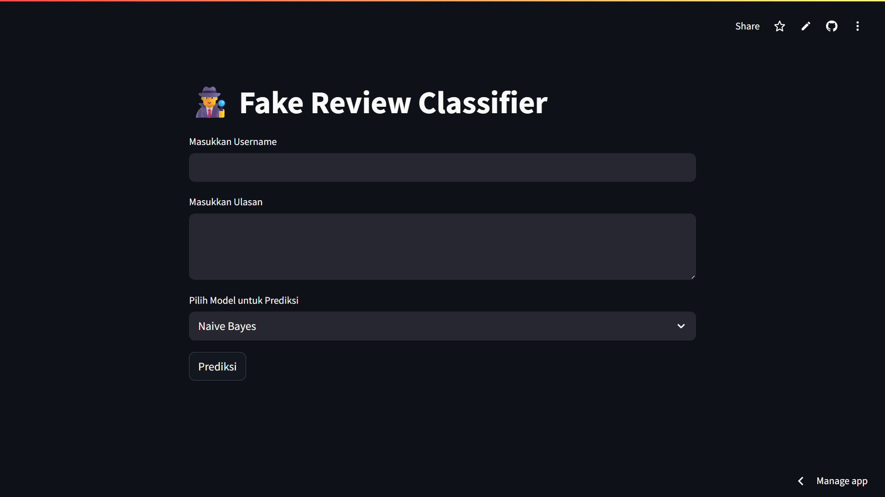

# 🕵️‍♂️ Fake Review Classifier 🕵️‍♀️
**Klasifikasi Ulasan Produk sebagai Asli atau Palsu Menggunakan Machine Learning (Naive Bayes, Random Forest, Decision Tree)**



---

## 🚀 Demo Langsung
🔗 [Coba Aplikasinya di Streamlit Cloud](https://fake-review-classifier.streamlit.app/)
*(Ganti dengan tautan Streamlit Cloud Anda yang sebenarnya)*

---

## 💡 Ikhtisar
Proyek ini adalah aplikasi web Streamlit yang dirancang untuk **mendeteksi ulasan produk palsu**. Aplikasi ini menggunakan machine learning untuk mengklasifikasikan ulasan sebagai "Real" atau "Fake" berdasarkan teks ulasan, nama pengguna pengulas, dan panjang ulasan.

Aplikasi ini menggunakan model machine learning berikut:
- 🌳 **Random Forest**
- 🌲 **Decision Tree**
- 🧠 **Naive Bayes**

Cukup masukkan nama pengguna dan ulasan, pilih model, dan biarkan aplikasi menentukan keasliannya.

---

## 📊 Performa Model
Model-model dilatih dan dievaluasi, menghasilkan akurasi berikut:
- **Random Forest**: 83% Akurasi
- **Decision Tree**: 78% Akurasi
- **Naive Bayes**: 63% Akurasi

---

## 🧠 Fitur
✅ **Pemilih Model**: Pilih dari Naive Bayes, Random Forest, atau Decision Tree.
📝 **Input Teks & Pengguna**: Sediakan teks ulasan dan nama pengguna untuk prediksi.
🤖 **Rekayasa Fitur**: Prediksi didasarkan pada kombinasi:
  - Vektorisasi TF-IDF dari teks ulasan.
  - Encoding kategorikal dari nama pengguna.
  - Jumlah total kata dari ulasan.
🔮 **Prediksi Instan**: Dapatkan klasifikasi "Real" atau "Fake" secara langsung.

---

## 📁 Cara Menjalankan Secara Lokal

1.  Gandakan (clone) repositori ini:
    ```bash
    git clone https://github.com/fbrianzy/fake-review-classifier
    cd fake-review-clssifier
    ```

2.  Instal dependensi yang diperlukan:
    ```bash
    pip install -r requirements.txt
    ```

3.  Jalankan aplikasi Streamlit:
    ```bash
    streamlit run app.py
    ```
